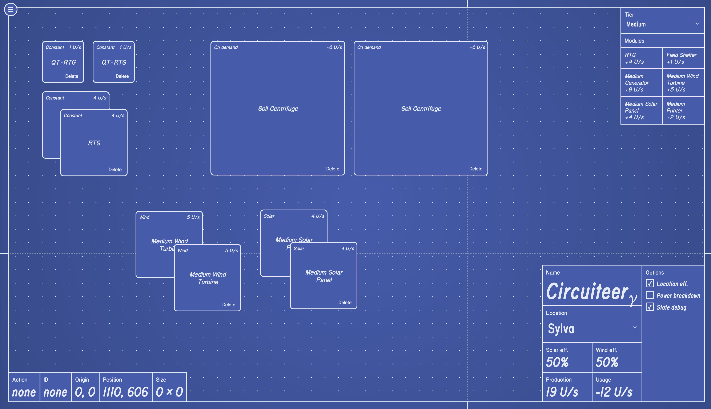

# `@etm12/circuiteer`



## Getting started

```sh
git clone https://github.com/stuf/circuiteer.git
cd circuiteer
yarn
yarn dev
```

## Available scripts

- `start` — run application normally; default port `3000`, auto-open browser to dev server
- `dev` — run in dev mode; port `7070`, without browser auto-open
- `test` — run tests in watch mode
- `test:cov` — run tests once and generate code coverage report
