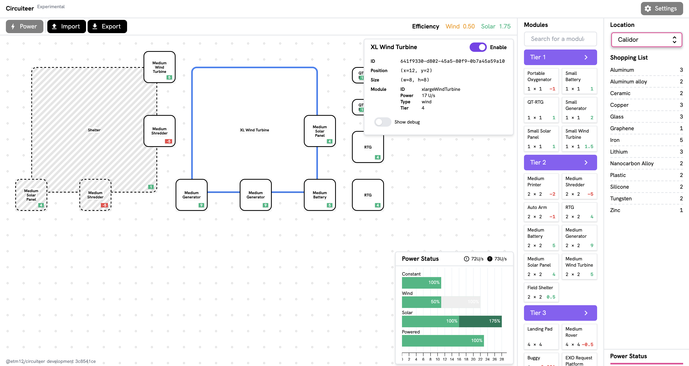

# `circuiteer`

Experimental webapp for planning Astroneer bases, basically.

> Try it out [here](https://circuiteer.etm12.moe) (alpha)



## Getting started

```sh
git clone https://github.com/stuf/circuiteer.git
cd circuiteer
npm install
npm start
```

Currently due to funny business because of Tailwind's version requirements Yarn for some reason installs things wrong.

## Available scripts

- `start` — run application locally with development server, browser auto-open disabled by default
- `test` — run unit tests
- `test:cov` — generate code coverage report
- `test:e2e` — run Cypress tests
- `deps:run` — runs [`dependency-cruiser`][]; most likely not the script you want to run as-is, it's used as a base for rest of `deps:` scripts
- `deps:validate` — validate application dependencies with a non-zero exit on error; see [`.dependency-cruiser.js`][] for configuration
- `deps:save-cruise` — run [`dependency-cruiser`][] for the application source and save the generated cruise
- `deps:report-html` — create HTML file containing found violations of dependency validation

[`dependency-cruiser`]: https://github.com/sverweij/dependency-cruiser
[`.dependency-cruiser.js`]: ./.dependency-cruiser.js
